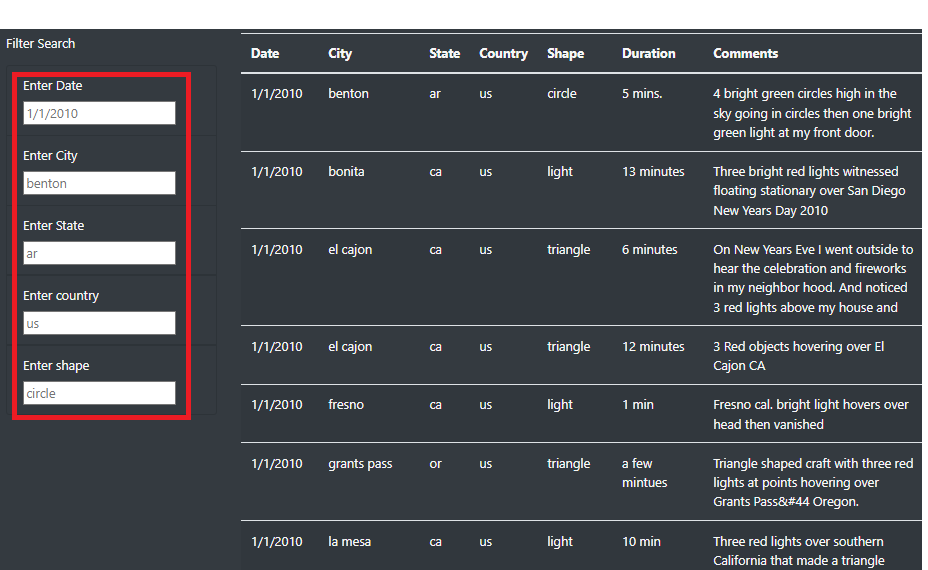
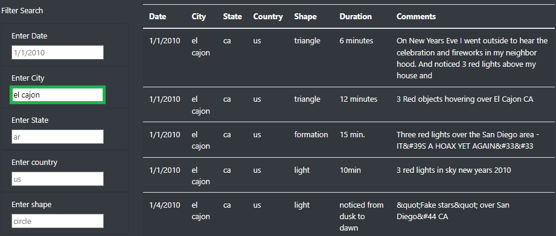
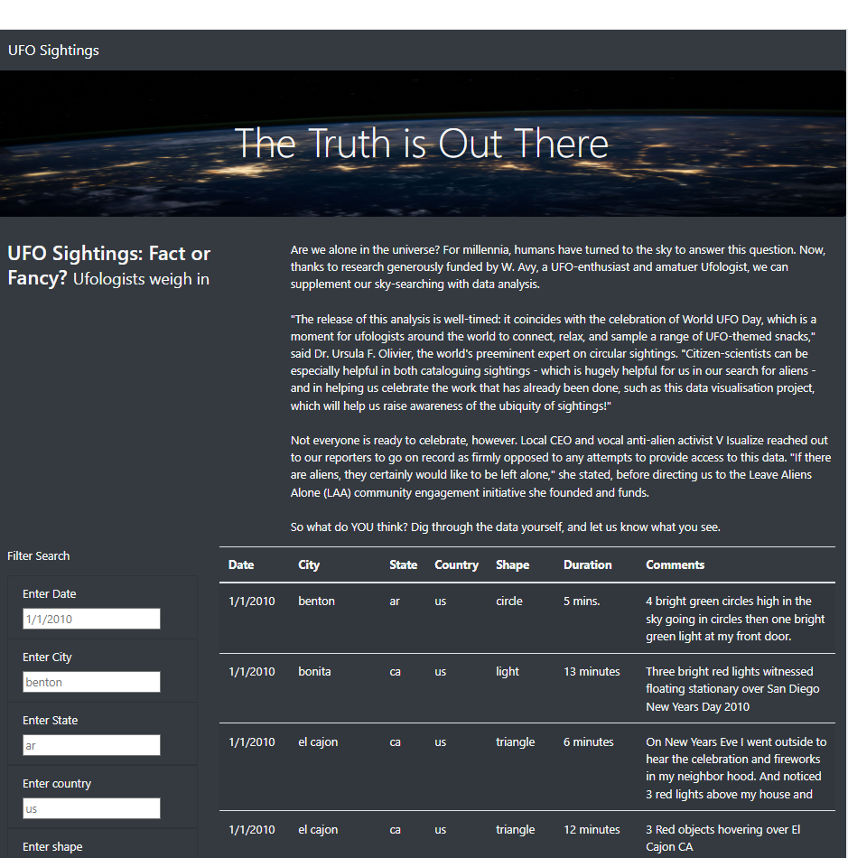

# UFOs

# Overview of Project

The objective of this project was to build a website that provides a more in-depth analysis of UFO sightings by allowing users to filter for multiple criteria at the same time.For instance, a user should be able to input a particular city, date, shape or state and the result rendered will only be for that specific input.

## Resources

- Visual Studio Code

- D3.js

- HTML

- Javascript

- CSS

- Bootstrap

### Results

In HTML, five list elements were created to enable the user to input particular data such as date, city or shape. Behind the scenes, we created a couple of javascript functions to enable the filters to work efficiently. Finally, bootstrap and css were used to enhance the background and design of the website. Below are snippets of the results step by step.

In this image, no filter was applied. The red rectangle potrays the input box with place holders which have no effect to the filter except show the user the format of how data should be input. We have data that is mixed.

When a user inputs a specific filter such as state "ca", all states with "ca" data will populate. They can add another filter such as shape "circle" and the filtered data will be reduced to only "ca" states "circle" shape.

On the image below, we can see a filter was added to the city input box highlighted in green. There are five results and all of them are filtered to the city of "el cajon".

Finally, the image below is a snippet of the final website.
 

### Summary

Limitation

There is not a way to remove a single filter without needing to reset the entire table. This would cause some challenges in the exploration of certain datasets.

Recommendations

- Allow flexibility by adding a search engine that would let the user select any word just like the (CTR + F) short cut. 

- Create options for dropdown text boxes where the user is able to scroll over the results incase they do not know exactly what they are looking for. 
